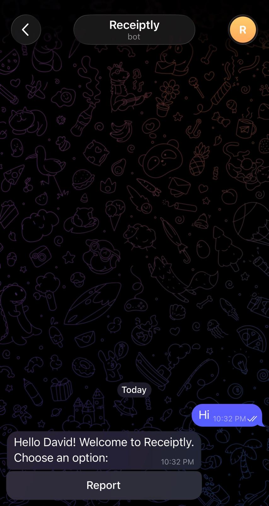
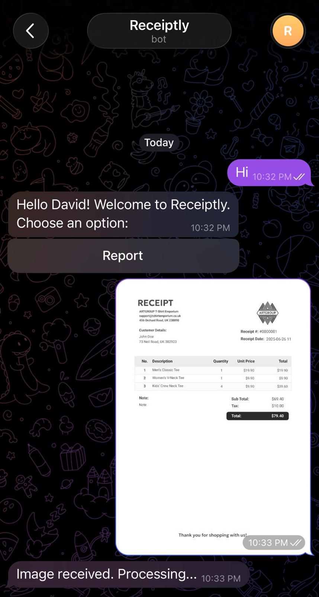
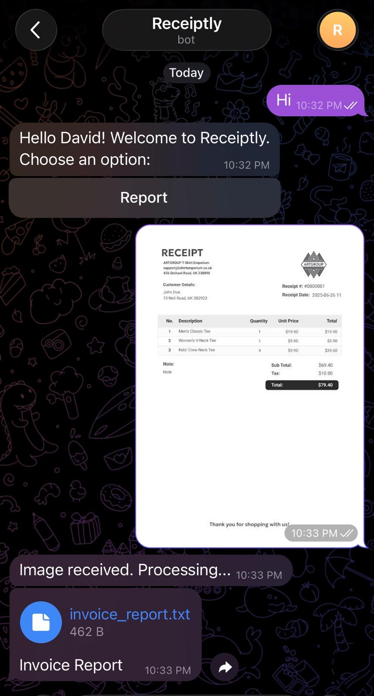
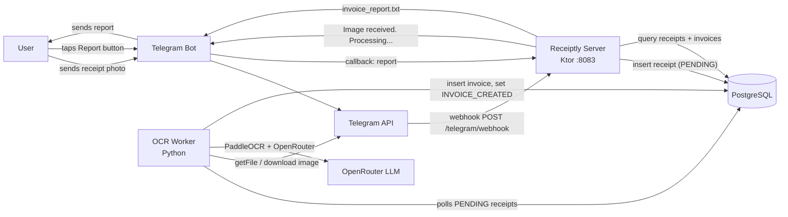

# Receiptly

Receiptly is a **Telegram bot** that turns photos of receipts into structured, organized expense records. You send a photo of a receipt and Receiptly extracts the invoice details (supplier, amounts, taxes, date, category) and stores them. Tap the **Report** button and you receive a `.txt` report of all your processed invoices.

It is split into two services:

| Service | Language/Stack | Role |
| --- | --- | --- |
| `server/` | Kotlin, Ktor, Exposed, Telegram Bot API | Telegram webhook bot. Receives messages, persists receipts, generates reports |
| `ocr/` | Python, PaddleOCR, OpenRouter (LLM) | Background worker. Polls for pending receipts, OCRs the image, extracts the invoice, saves it |

Data flows: Telegram → `server` webhook → PostgreSQL → `ocr` worker → OpenAI/OpenRouter → PostgreSQL → back to the user.

# DEMO
<p align="center">
  <b>Start</b><br>
  
  <br><br>
  <b>Send Image</b><br>
  
  <br><br>
  <b>Click Report</b><br>
  
</p>
## Architecture



## How to run

### 1. Create a Telegram bot

- Open Telegram and search for **@BotFather**.
- Send `/newbot`, choose a name and a username for your bot.
- Copy the **bot token** BotFather gives you (format `123456:ABC...`).

### 2. Clone the repository

```bash
git clone <repo-url>
cd Receiptly
```

### 3. Start the database

```bash
cd docker
docker compose up -d
```

This starts PostgreSQL 16 on `localhost:5432` (database `receiptly`, user/password `postgres`/`postgres`).

### 4. Run the migrations

```bash
brew install flyway
```

```bash
flyway \
  -url="jdbc:postgresql://localhost:5432/receiptly" \
  -user="postgres" \
  -password="{}" \
  -locations="filesystem:app/src/main/resources/db/migration" \
  migrate
```

### 5. Run the server

```bash
cd server
TELEGRAM_BOT_TOKEN=<your_bot_token> ./gradlew :app:run
```


The Ktor server listens on `http://localhost:8083` (health check at `/health`).

### 6. Run the OCR worker

```bash
cd ocr
poetry install
TELEGRAM_BOT_TOKEN=<your_bot_token> \
OPENROUTER_API_KEY=<your_openrouter_api_key> \
poetry run python -m reciply_ocr.main
```

The worker polls PostgreSQL every 120 seconds for `PENDING` receipts, OCRs them with PaddleOCR, and extracts invoices via OpenRouter.

### 7. Expose the server with ngrok

```bash
ngrok http 8083
```

Copy the HTTPS forwarding URL from the ngrok output (e.g. `https://abc123.ngrok.io`).

### 8. Point the Telegram webhook at the server

```bash
curl -X POST "https://api.telegram.org/bot<your_bot_token>/setWebhook" \
  -H "Content-Type: application/json" \
  -d '{"url":"https://abc123.ngrok.io/telegram/webhook"}'
```

### 9. Chat from Telegram

- Open your bot in Telegram and send any message to see the **Start** / **Report** buttons.
- Send a **photo of a receipt** — you'll get "Image received. Processing...".
- Wait for the OCR worker to process it, then tap **Report**.
- Receiptly sends back a single `invoice_report.txt` containing all your invoices.
